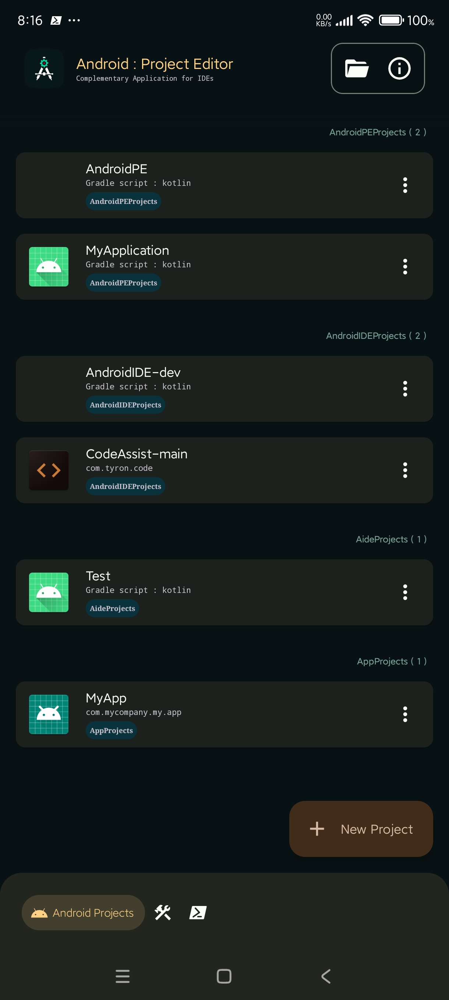
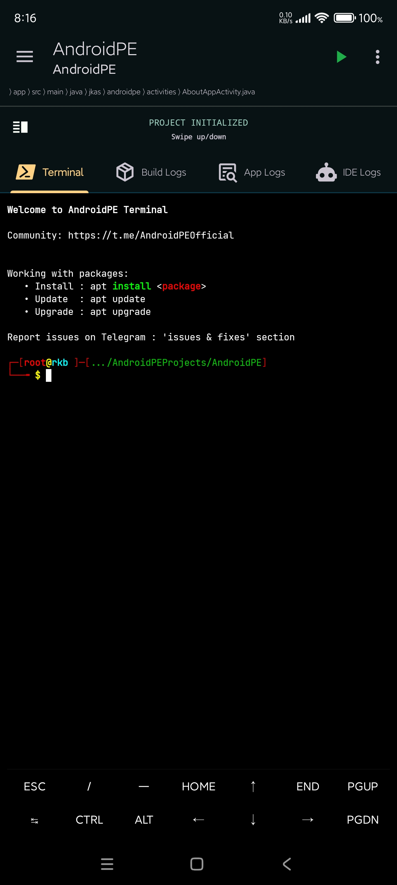

<p align ="center">
  
</p>
<h1 align="center">AndroidPE</h1>
<p align="center">
  A <b>IDE</b> to edit, preview, and build your projects directly from your mobile device.
</p>


# Features
### Resources & Ui Designer
- [X] WYSIWYG layout editor
- [X] Drag and drop interface
- [X] Component properties with value auto-completion
- [X] Preview mode
- [X] res/menu (experimental)
- [X] res/values (`colors`, `dimens`, `integers`, `strings`)


### Project management
- [X] Multi-module project supported (Android Project only)
- [X] Addition and dependencies between modules
- [X] Management of `Activities`, `Permissions`, `Services`, `...`
- [X] Translation Editor (Experimental)


### Screenshots
<div style="overflow: hidden">
 
 
 
 
 
 
 
 
</div>


# Community
* Join Telegram Group : [AndroidPEOfficial](https://t.me/AndroidPEOfficial)


# License

```
AndroidPE - Your IDE in your pocket !

AndroidPE is free software: you can redistribute it and/or modify
it under the terms of the GNU General Public License as published by
the Free Software Foundation, either version 3 of the License, or
(at your option) any later version.

AndroidPE is distributed in the hope that it will be useful,
but WITHOUT ANY WARRANTY; without even the implied warranty of
MERCHANTABILITY or FITNESS FOR A PARTICULAR PURPOSE.  See the
GNU General Public License for more details.

You should have received a copy of the GNU General Public License
along with AndroidPE.  If not, see <https://www.gnu.org/licenses/>.
```
Any violations to the license can be reported either by opening an issue or writing a mail to us
directly.
